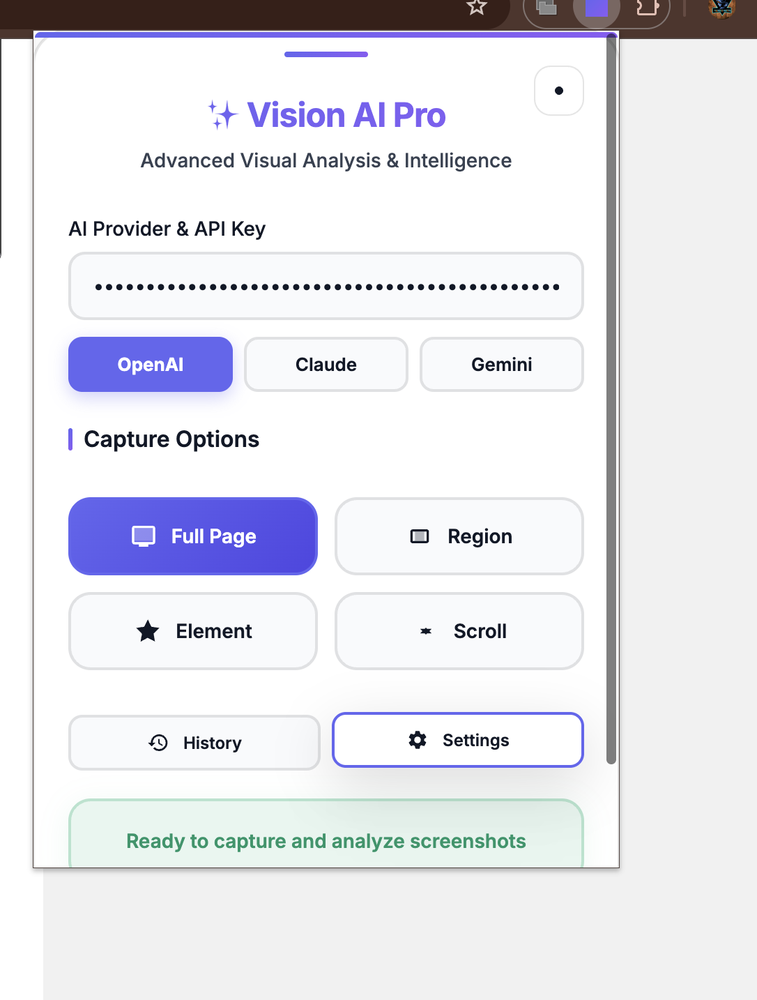
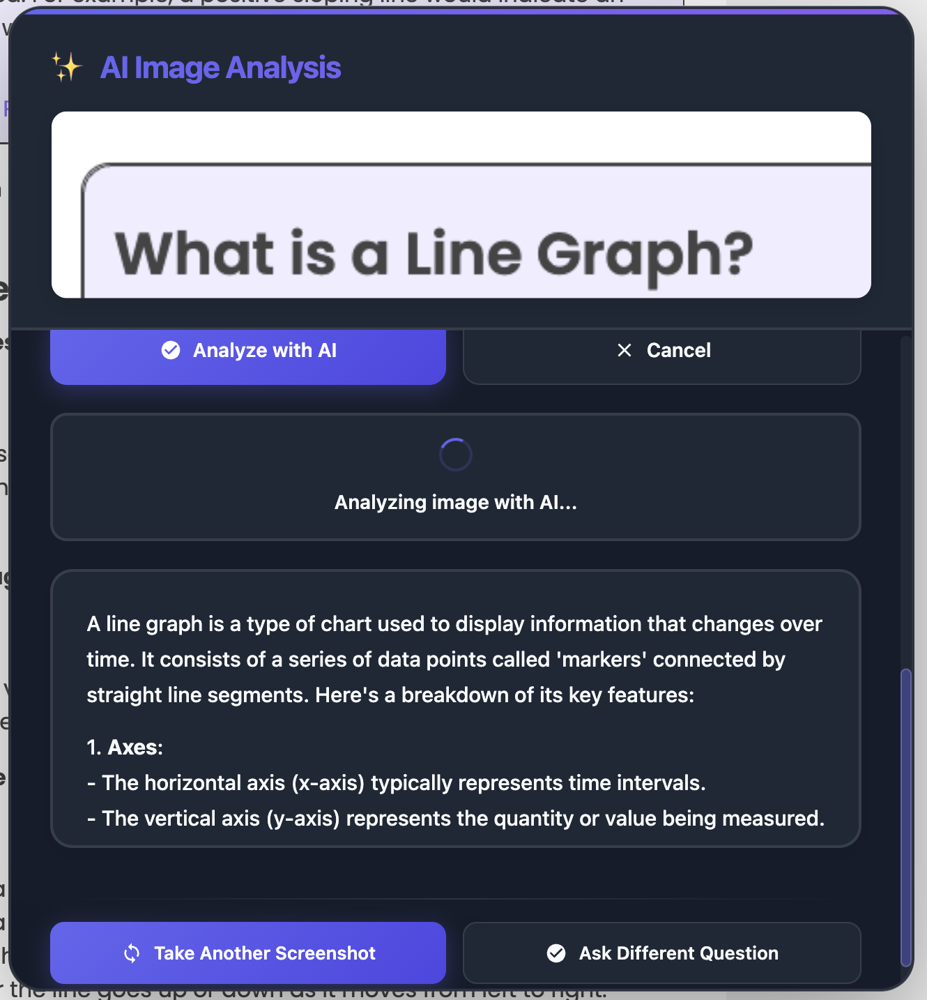

# Vision AI Pro - Advanced Screenshot & AI Analysis Extension

A modern, professional Chrome extension for capturing screenshots and analyzing them with advanced AI capabilities.

## 📸 Demo Screenshots

### Main Interface & Screenshot Capture

*Professional glassmorphism UI with multiple capture modes and AI provider selection*

### AI Analysis Dialog & Results

*Comprehensive AI analysis with markdown rendering and continue workflow options*

### Settings Panel & Configuration

*Advanced settings panel with theme options, API configuration, and keyboard shortcuts*

## 🚀 Features

### Screenshot Capture
- **Full Page Capture** - Capture entire web pages with one click
- **Region Selection** - Select specific areas with precision
- **Element Capture** - Click on any element to capture it specifically
- **Scrolling Screenshots** - Capture long pages that require scrolling
- **High-DPI Support** - Perfect quality on retina displays

### AI Analysis
- **Multiple AI Providers** - Support for OpenAI GPT-4V, Anthropic Claude, and Google Gemini
- **Smart Prompts** - Pre-built prompts for common analysis tasks
- **OCR & Text Extraction** - Extract and analyze text from images
- **Layout Analysis** - Understand UI/UX design and structure
- **Custom Questions** - Ask specific questions about your screenshots

### Modern UI/UX
- **Glassmorphism Design** - Beautiful modern interface with blur effects
- **Dark/Light Theme** - Automatic theme switching
- **Smooth Animations** - Polished micro-interactions
- **Responsive Design** - Works perfectly on all screen sizes
- **Keyboard Shortcuts** - Fast workflow with hotkeys

## ⌨️ Keyboard Shortcuts

- `Ctrl+Shift+F` (Mac: `Cmd+Shift+F`) - Full page screenshot
- `Ctrl+Shift+R` (Mac: `Cmd+Shift+R`) - Region selection
- `Ctrl+Shift+E` (Mac: `Cmd+Shift+E`) - Element capture
- `Escape` - Cancel current operation

## 🎯 What Makes Vision AI Pro Special

### 🎨 **Professional Design**
- **Modern Glassmorphism UI** with translucent surfaces and backdrop blur effects
- **Responsive Layout** that adapts to any screen size
- **Dark/Light Theme** with automatic system detection
- **Smooth Animations** and micro-interactions for premium feel

### 🤖 **Advanced AI Analysis**
- **Multiple AI Providers** - OpenAI GPT-4V, Claude 3, and Gemini Pro Vision
- **Comprehensive Analysis** - Beyond OCR: analyze graphs, UI elements, data visualizations
- **Smart Prompts** - 10+ preset analysis types for different use cases
- **Markdown Rendering** - Properly formatted results with headers, lists, and code blocks

### 📸 **Powerful Screenshot Tools**
- **4 Capture Modes** - Full page, region selection, element targeting, and scroll capture
- **High-DPI Support** - Perfect quality on retina displays
- **Multiple Formats** - PNG, JPEG, WebP with quality control
- **Auto-Analysis** - Optional automatic AI analysis after capture

### ⚡ **Productivity Features**
- **Continue Workflow** - Take multiple screenshots or ask different questions
- **Settings Panel** - Comprehensive configuration for all preferences
- **Keyboard Shortcuts** - Fast workflow with customizable hotkeys
- **Export/Import** - Backup and restore your settings

## 🔧 Setup

1. **Install the Extension**
   - Load unpacked extension in Chrome Developer Mode
   - Point to this directory

2. **Configure AI Provider**
   - Click the extension icon
   - Select your preferred AI provider (OpenAI, Anthropic, or Google)
   - Enter your API key

3. **Start Capturing**
   - Use the popup interface or keyboard shortcuts
   - Select your capture method
   - Let AI analyze your screenshots

## 🎨 Design Features

- **Advanced Glassmorphism** - Translucent surfaces with backdrop blur
- **Gradient Accents** - Beautiful color transitions
- **Micro-interactions** - Hover effects and smooth transitions
- **Modern Typography** - Clean, readable Inter font
- **Responsive Layout** - Adapts to different screen sizes
- **Accessibility** - Proper contrast and keyboard navigation

## 🔒 Privacy & Security

- **Local Processing** - Screenshots processed locally when possible
- **Secure API Calls** - Encrypted communication with AI providers
- **No Data Storage** - No screenshots or analysis stored permanently
- **API Key Protection** - Keys stored securely in Chrome's sync storage

## 🛠️ Technical Details

- **Manifest V3** - Latest Chrome extension standard
- **Modern JavaScript** - ES6+ classes and async/await
- **CSS Grid & Flexbox** - Modern layout techniques
- **Service Worker** - Efficient background processing
- **Content Scripts** - Seamless page integration

## 📋 Supported AI Providers

### OpenAI GPT-4 Vision
- Model: `gpt-4o`
- Best for: General analysis, detailed descriptions
- API Key format: `sk-...`

### Anthropic Claude
- Model: `claude-3-sonnet-20240229`
- Best for: Detailed analysis, safety-focused responses
- API Key format: `sk-ant-...`

### Google Gemini
- Model: `gemini-pro-vision`
- Best for: Fast analysis, multilingual support
- API Key: Google AI Studio key

## 🚀 Quick Start Guide

1. **Install & Setup** (2 minutes)
   - Load the extension in Chrome Developer Mode
   - Click the extension icon and enter your AI API key
   - Choose your preferred AI provider

2. **Take Your First Screenshot**
   - Press `Ctrl+Shift+F` for full page capture
   - Or use `Ctrl+Shift+R` to select a specific region
   - The AI analysis dialog will appear automatically

3. **Analyze with AI**
   - Choose a preset prompt or write your own question
   - Click "Analyze with AI" or press `Ctrl+Enter`
   - View the formatted results with proper markdown rendering

4. **Continue Your Workflow**
   - Use "Take Another Screenshot" for more captures
   - Or "Ask Different Question" to analyze the same image differently

## 🎯 Use Cases & Examples

### 📊 **Data Analysis**
- **Sales Dashboards** - "Analyze the trends in this sales chart and provide insights"
- **Analytics Reports** - "What are the key metrics and their implications?"
- **Survey Results** - "Summarize the main findings from this data visualization"

### 🖥️ **Web Development & Design**
- **UI/UX Review** - "Evaluate the user experience of this interface design"
- **Responsive Testing** - "Identify any layout issues or design inconsistencies"
- **Accessibility Audit** - "Check this page for accessibility improvements"

### 📄 **Content & Documentation**
- **OCR & Text Extraction** - "Extract all text from this document and format it clearly"
- **Technical Documentation** - "Explain this code snippet and its functionality"
- **Meeting Screenshots** - "Summarize the key points from this presentation slide"

### 🔍 **Research & Analysis**
- **Academic Papers** - "Explain the methodology shown in this research diagram"
- **News Articles** - "Summarize the main points from this article screenshot"
- **Social Media** - "Analyze the engagement patterns in this social media post"

### 🏢 **Business & Professional**
- **Presentations** - "Improve the visual hierarchy of this slide design"
- **Reports** - "Extract key financial data from this quarterly report"
- **Workflows** - "Explain the process flow shown in this diagram"

## 🛠️ Troubleshooting

### Common Issues

**"Could not establish connection" Error**
- Refresh the webpage and wait 2-3 seconds before using the extension
- Make sure you're not on browser internal pages (chrome://, about:, etc.)
- The extension automatically injects content scripts if needed

**Continue Buttons Hidden/Cropped**
- The dialog automatically adjusts to fit your screen size
- Scroll within the dialog if content is long
- Look for the "↓ Scroll for more" indicator

**API Key Issues**
- Use the "Test" button in settings to verify your API keys
- Ensure correct format: OpenAI (`sk-proj-...`), Claude (`sk-ant-...`)
- Check your API quota and billing status

**Extension Not Working**
- Verify the extension is enabled in `chrome://extensions/`
- Try reloading the extension from the Chrome Extensions page
- Check browser console for error messages (F12 → Console)

### Getting Help
- Open the Help page from the popup (question mark icon)
- Check the comprehensive test page for examples
- Review the settings panel for configuration options

## 🔄 Version History

### v2.0 (Current) - Major Redesign
- ✨ **Complete UI/UX redesign** with professional glassmorphism
- 🤖 **Multiple AI provider support** (OpenAI, Claude, Gemini)
- 📸 **Enhanced capture modes** (full page, region, element, scroll)
- 🎨 **Advanced theming** with dark/light mode and auto-detection
- ⚙️ **Comprehensive settings panel** with export/import
- 🔄 **Continue workflow** with "Take Another Screenshot" functionality
- 📝 **Markdown rendering** for properly formatted AI responses
- ⌨️ **Enhanced keyboard shortcuts** and accessibility
- 📱 **Responsive design** that works on all screen sizes
- 🔧 **Better error handling** and user guidance
- 🎯 **Smart dialog sizing** ensures buttons are always visible
- 🚀 **Performance optimizations** and smooth animations

### v1.0 - Initial Release
- Basic screenshot capture functionality
- OpenAI GPT-4V integration
- Simple popup interface
- Region selection tool

## 📊 Feature Comparison

| Feature | Vision AI Pro v2.0 | Basic Screenshot Tools |
|---------|-------------------|------------------------|
| **Multiple AI Providers** | ✅ OpenAI, Claude, Gemini | ❌ None |
| **Advanced UI Design** | ✅ Glassmorphism, Themes | ❌ Basic UI |
| **Comprehensive Analysis** | ✅ Graphs, UI, OCR, Objects | ❌ No analysis |
| **Continue Workflow** | ✅ Multiple screenshots | ❌ One-time use |
| **Settings Panel** | ✅ Full configuration | ❌ Limited options |
| **Markdown Rendering** | ✅ Formatted results | ❌ Plain text |
| **Responsive Design** | ✅ All screen sizes | ❌ Fixed layout |
| **Keyboard Shortcuts** | ✅ Full hotkey support | ❌ Limited shortcuts |
| **Element Targeting** | ✅ Click any element | ❌ Manual selection |
| **High-DPI Support** | ✅ Retina displays | ❌ Standard resolution |

## 🤝 Contributing

We welcome contributions to make Vision AI Pro even better! Here's how you can help:

### 🐛 **Bug Reports**
- Use the GitHub Issues tab to report bugs
- Include screenshots and steps to reproduce
- Mention your browser version and OS

### 💡 **Feature Requests**
- Suggest new AI analysis capabilities
- Propose UI/UX improvements
- Request new capture modes or integrations

### 🔧 **Development**
- Fork the repository and create feature branches
- Follow the existing code style and patterns
- Test thoroughly before submitting pull requests
- Update documentation for new features

### 📚 **Documentation**
- Improve setup guides and tutorials
- Add more use case examples
- Translate documentation to other languages
- Create video tutorials or demos

### 🎨 **Design**
- Suggest UI/UX improvements
- Create new icons or visual assets
- Improve accessibility and usability
- Design new themes or color schemes

## 🌟 **Show Your Support**

If you find Vision AI Pro useful:
- ⭐ Star this repository
- 🐦 Share it on social media
- 📝 Write a review or blog post
- 🤝 Contribute to the project
- 💬 Join discussions and help other users

## 📄 License

This project is open source and available under the MIT License.

---

**Made with ❤️ for enhanced productivity and AI-powered visual analysis**

*Transform your screenshot workflow with professional AI analysis capabilities*
